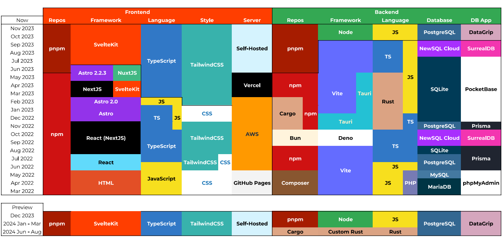

# From PHP to Tauri: My 1-Year Journey as a Full-Stack Developer

## Introduction
Are you curious about the latest advancements in frontend and backend development? Join me on my journey from HTML and CSS to the cutting-edge technologies like Tauri, Svelte, and Rust. Discover how I pushed the limits of web development over the past year!

## Timeline and Technologies

| Month          | Technologies                           | Frontend/Backend |
| -------------- | -------------------------------------- | ---------------- |
| Mar 2022       | HTML, CSS, PHP                         | Frontend/Backend |
| Apr 2022       | MariaDB, Github Pages                  | Backend          |
| May 2022       | PostgreSQL, JavaScript                 | Backend          |
| Jun - Sep 2022 | React, TailwindCSS, Prisma, TypeScript | Frontend/Backend |
| Oct 2022       | Deno, SurrealDB                        | Backend          |
| Dec 2022       | Tauri, Svelte, Rust                    | Backend          |
| Jan 2023       | Astro 2.0, TailwindCSS, Svelte         | Frontend         |
| Feb 2023       | Vercel, AWS                            | Hosting          |
| Mar - Nov 2023 | SvelteKit, TypeScript, Node.js         | Frontend/Backend |

## Key Milestones
- **Embracing New Technologies**: Transitioned from traditional web technologies to modern frameworks like Tauri and Svelte.
- **Backend Evolution**: Moved from PHP to Rust, ensuring robust and secure backend solutions.
- **Frontend Development**: Leveraged the power of Svelte and Astro for dynamic and efficient UIs.

## Looking Ahead
As we approach 2024, my focus remains on SvelteKit and TypeScript for frontend and exploring custom Rust-based frameworks for backend development. The journey continues!

## Connect with Me
- [LinkedIn](#)
- [GitHub](#)
- [My Portfolio](#)

## Acknowledgments
A special thanks to all the open-source communities and developers who have contributed to my growth as a developer.

---

_My journey is a testament to continuous learning and adapting in the ever-evolving world of web development._

![Metrics](https://beta-metrics.lecoq.io/miguelgargallo?template=classic&base.repositories=0&isocalendar=1&languages=1&lines=1&habits=1&notable=1&repositories=1&base=header%2C%20activity%2C%20community%2C%20repositories%2C%20metadata&base.indepth=false&base.hireable=false&base.skip=false&repositories.batch=100&repositories.forks=false&repositories.affiliations=owner&isocalendar=false&isocalendar.duration=full-year&languages=false&languages.ignored=java%2C%20ruby%2C%20Go%2C%20html%2C%20css%2C%20mdx%2C%20md%2C%20txt&languages.limit=8&languages.threshold=0%25&languages.other=true&languages.details=percentage&languages.indepth=false&languages.analysis.timeout=0&languages.analysis.timeout.repositories=0&languages.recent.load=0&languages.recent.days=0&lines=false&lines.sections=base&lines.repositories.limit=10&lines.history.limit=1&lines.delay=0&habits=false&habits.from=200&habits.days=14&habits.facts=true&habits.charts=false&habits.charts.type=classic&habits.trim=false&habits.languages.limit=8&habits.languages.threshold=0%25&repositories=false&repositories.pinned=0&repositories.starred=6&repositories.random=0&repositories.order=featured%2C%20pinned%2C%20starred%2C%20random&notable=false&notable.filter=stars%3A%3E9&notable.from=user&notable.repositories=true&notable.indepth=false&notable.types=commit&notable.self=false&config.timezone=Europe%2FBerlin)
